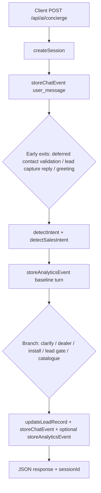

# Lead generation and analytics — end-to-end flow

This document describes how the Carysil **AskCary** chatbot records **sessions**, **leads**, **chat events**, and **analytics events**, and how the internal **dashboard** reads them. All server-side tracking for the main concierge flow runs through **`POST /api/ai/concierge`**.

---

## 1. High-level architecture

| Layer | Role |
|--------|------|
| **Client (widget)** | Sends `message`, optional `history`, optional `sessionId`, `source`, `deviceType`. Receives `sessionId` to keep one row per visitor conversation. |
| **`app/api/ai/concierge/route.ts`** | Orchestrates intent detection, recommendations, dealer lookup, lead capture gates, and **every write** to `chat_events`, `leads`, and `analytics_events`. |
| **`services/sessionService.ts`** | Ensures PostgreSQL schema, creates/updates `chat_sessions`, appends `chat_events`. |
| **`services/leadService.ts`** | Parses contact fields from messages, merges with DB, **upserts `leads`** and implements **`calculateLeadScore`**. |
| **`lib/followupEngine.ts`** | Follow-up questions, funnel **stages**, and **`updateLeadRecord`** (single entry point to persist lead updates + score). |
| **`services/analyticsService.ts`** | Inserts rows into **`analytics_events`** (query + intent snapshot + optional `event_type` + JSON `metadata`). |
| **`app/dashboard/page.tsx`** | Read-only aggregates and recent rows for ops visibility. |

**Note:** `POST /api/ai/dealer-routing` assigns a dealer from static JSON for display text only; it does **not** write to the lead/analytics tables.

---

## 2. Data model (PostgreSQL)

Schema is created idempotently by `ensureLeadSchema()` (same definitions live in `db/lead_generation_schema.sql` and embedded SQL in `sessionService.ts`).

### `chat_sessions`

- One row per `session_id` (UUID from client or server).
- Tracks `started_at`, `last_active`, optional `source` (default `"chat_widget"`), `device_type`.

### `chat_events`

Append-only log of conversation and system milestones: `role` (`user` \| `assistant` \| `system`), `message`, `event_type`, `metadata` (JSONB), `created_at`.

Relevant `event_type` values include: `user_message`, `assistant_message`, `recommendations_shown`, `recommendations_deferred`, `dealer_results_shown`, `lead_prompted`, `lead_captured`, `followup_question_asked`, `cross_sell_offered`, `dealer_request` (typed in `types/lead.ts`; dealer flows primarily emit `dealer_results_shown` as the system chat event), `quotation_request`, `installation_request`.

**Deferred recommendations:** When contact is required before showing products, the original user query is stored as a system event `recommendations_deferred` with `metadata.userQuery` (`deferredRecommendationService.ts`). After successful capture, that deferred row is cleared and the pipeline can run on the stored query.

### `leads`

At most **one lead row per session** (`session_id` UNIQUE). Fields include contact PII (name, phone, email, city), `intent`, `interested_product`, `interested_products` (JSONB array of shown products), `followup_stage`, `lead_score` (capped at 100 on upsert), timestamps.

### `analytics_events`

One row per tracked “analytics moment”: `session_id`, `query` (typically the latest user message), `detected_intent`, `category`, `budget_type`, `city`, optional `event_type`, `metadata`, `created_at`. Used for funnel and segmentation reporting (category / intent / city breakdowns).

---

## 3. Request lifecycle (concierge `POST`)

1. **`createSession`** — Upserts `chat_sessions` for `body.sessionId` or a new UUID; records `source` / `deviceType`.
2. **`storeChatEvent`** — Every turn starts by logging the user message as `user_message`.
3. **Lead capture short-circuit** — If the assistant recently asked for lead details and the user reply contains valid contact signals, the handler may **`updateLeadRecord`** with stage `lead_captured`, emit `lead_captured` chat + analytics events, and return early (or continue into deferred catalogue flow after `clearDeferredProductQuery`).
4. **Greeting short-circuit** — Simple greetings get a fixed reply, one `assistant_message`, and an analytics row **without** a special `event_type` (intent snapshot only).
5. **Main path** — After intent + sales-intent detection, a **baseline** `storeAnalyticsEvent` runs for almost every non-short-circuited turn (user `query` + detected sales fields).
6. **Branch-specific** behaviour adds more `updateLeadRecord`, `storeChatEvent`, and sometimes **additional** `storeAnalyticsEvent` rows with explicit `event_type` (e.g. `dealer_request`, `installation_request`, `lead_prompted`, `recommendations_shown`).

---

## 4. Lead generation: stages and scoring

### Follow-up stages (`followup_stage` on `leads`)

Defined in `types/lead.ts` — examples: `browsing` → `preferences_collected` → `recommendations_shown` → `cross_sell_offered` / `dealer_offered` → `lead_requested` → `lead_captured`. The concierge sets the stage on each meaningful `updateLeadRecord` call depending on the branch (clarification, dealer cards, contact-before-catalogue gate, recommendation turn, captured lead).

### Contact extraction and PII safety

- **`extractContactInfo` / `extractLeadData`** (via `leadService` / `followupEngine`) parse phone (Indian mobile pattern), email, name, city from the user text and history.
- **`shouldPersistContactFieldsFromUserTurn`** and **`contactInfoForLeadDatabaseUpdate`** prevent saving misleading PII (e.g. product chip text as a name) unless the conversation is in an allowed “capture window”.
- **`mergeContactForRuntime`** merges extracted vs stored contact for scoring when PII must not yet be persisted.

### Lead score (`calculateLeadScore` + `updateLead`)

Each `updateLeadRecord` computes a **delta** from:

- Recommendations shown (+1 if any),
- Signals: budget purchase (+3), dealer inquiry or dealers shown (+5), quotation/contact request (+7),
- Contact: phone (+10), email (+10), city (+2).

`updateLead` applies `ON CONFLICT (session_id)` and sets `lead_score = LEAST(100, leads.lead_score + delta)`. Extra bonuses (e.g. +5 on `lead_captured`, +2 on lead prompts) are added via `extraScore` in `updateLeadRecord`.

### Product interest on the lead row

When recommendations are shown, `deriveInterestedProducts` builds JSON for `interested_products`; `interested_product` can hold a category label string.

---

## 5. Analytics: what gets logged when

### Baseline (most turns)

After intent resolution, **`storeAnalyticsEvent`** is called with the user message as `query` and the output of **`detectSalesIntent`** (`detected_intent`, `category`, `budget_type`, `city` from contact/sales intent). `event_type` may be omitted.

### Typed analytics events (`event_type` on `analytics_events`)

| When | Typical `event_type` | Notes |
|------|----------------------|--------|
| User agrees to dealer connect | `lead_prompted` | Metadata: reason |
| Contact requested before catalogue | `lead_prompted` | Metadata: `contact_before_recommendations` |
| Contact details saved as lead | `lead_captured` | Metadata: flags for phone/email/city |
| Dealer list returned (location or all-India) | `dealer_request` | Metadata: dealer count, location |
| Installation path | `installation_request` | Metadata: categories |
| Product cards shown | `recommendations_shown` | Metadata: count + product ids |
| Follow-up question after recommendations | `followup_question_asked` or `lead_prompted` | Mirrors whether the engine is asking for contact |

Parallel **chat_events** record human-readable assistant lines and system milestones (`recommendations_shown`, `dealer_results_shown`, etc.) for a full audit trail.

---

## 6. Dashboard (`app/dashboard/page.tsx`)

After `ensureLeadSchema()`, the dashboard loads:

- **Totals:** session count, lead count, analytics event count, chat event count, “hot leads” (`lead_score >= 5`), follow-ups asked (chat events: `followup_question_asked` or `cross_sell_offered`), leads captured (`lead_captured`), dealer-related chat events (`dealer_results_shown` or `dealer_request`).
- **Breakdowns:** Top categories, intents, cities from **`analytics_events`**; top **`followup_stage`** from **`leads`**.
- **Recent lists:** Top leads by score, latest analytics rows (query + intent fields), latest chat events.

The “recent analytics” table query does not surface `event_type` or `metadata` in the UI query, but those columns exist for deeper reporting or SQL exports.

---

## 7. File reference (quick map)

| Concern | Primary files |
|---------|----------------|
| HTTP entry + branching | `app/api/ai/concierge/route.ts` |
| Lead upsert SQL | `services/leadService.ts` |
| Stage / follow-up / `updateLeadRecord` | `lib/followupEngine.ts` |
| Sales intent classification | `lib/intentDetection.ts` (used by concierge) |
| Analytics insert | `services/analyticsService.ts` |
| Session + chat events + schema | `services/sessionService.ts` |
| Deferred query storage | `services/deferredRecommendationService.ts` |
| Types | `types/lead.ts` |
| SQL snapshot | `db/lead_generation_schema.sql` |
| Dashboard | `app/dashboard/page.tsx` |

---

## 8. Operational summary

- **Lead generation** is **session-scoped**: one lead row per chat session, continuously enriched and scored as the user progresses through the funnel until **`lead_captured`** (or remains at an earlier stage).
- **Analytics** is **event-stream**: at least one row per meaningful user turn (baseline), plus extra rows for funnel milestones (`lead_prompted`, `lead_captured`, `dealer_request`, `recommendations_shown`, etc.).
- **Chat events** provide the narrative and power metrics like “follow-ups asked” and “leads captured” alongside the richer **`analytics_events`** table for intent/category/city trends.
